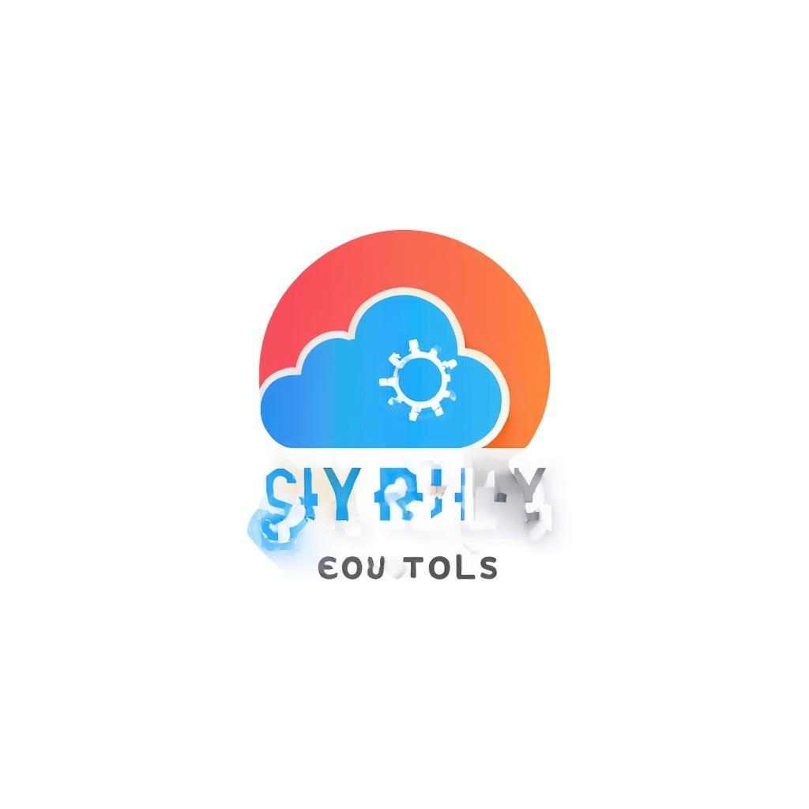

# 🛒 DIVINITY SKY TOOLS - E-commerce de Productos Tecnológicos

<div align="center">
  
  
  **Tu catálogo digital de productos tecnológicos**
  
  [](https://nextjs.org/)
  [](https://www.typescriptlang.org/)
  [](https://pages.cloudflare.com/)
  [](https://www.prisma.io/)
</div>

---

## 📖 Descripción

**Divinity Sky Tools** es una plataforma de e-commerce completa para la venta de productos tecnológicos. Incluye un portal de usuario para realizar compras y un panel de administración para gestionar el catálogo, pedidos y usuarios.

## ✨ Características

### 🛍️ Portal de Usuario
- **Home**: Banner promocional, categorías y productos destacados
- **Catálogo**: Grid de productos con filtros, búsqueda y ordenamiento
- **Detalle de producto**: Información completa con especificaciones técnicas
- **Carrito de compras**: Gestión de productos con persistencia local
- **Checkout**: Proceso de compra con cálculo de impuestos y envío
- **Historial de pedidos**: Seguimiento de compras realizadas

### 👨‍💼 Panel de Administración
- **Dashboard**: Estadísticas generales, pedidos recientes, alertas de stock bajo
- **Productos**: CRUD completo, gestionar destacados y productos nuevos
- **Categorías**: Administración de categorías del catálogo
- **Pedidos**: Gestión de pedidos, cambio de estados, detalles de compra

### 🎨 Diseño
- **Tema claro/oscuro**: Cambio de tema con persistencia
- **Responsive**: Adaptado para móvil, tablet y desktop
- **Colores**: Azul primario (`#2563EB`) y mamey (`#FF6B35`)

---

## 🛠️ Tecnologías

| Categoría | Tecnología |
|-----------|------------|
| **Framework** | Next.js 16 (App Router) |
| **Lenguaje** | TypeScript 5 |
| **Estilos** | Tailwind CSS 4 + shadcn/ui |
| **Base de datos** | SQLite (dev) / D1 (Cloudflare) |
| **Autenticación** | NextAuth.js v4 |
| **Estado** | Zustand |
| **Hosting** | Cloudflare Pages |

---

## 📦 Instalación Local

```bash
# Clonar el repositorio
git clone https://github.com/vertiljivenson9/Divinity-Tech.git
cd Divinity-Tech

# Instalar dependencias
npm install

# Configurar variables de entorno
cp .env.example .env

# Inicializar base de datos
npx prisma db push
npx prisma db seed

# Iniciar servidor de desarrollo
npm run dev
```

---

## ☁️ Despliegue en Cloudflare

### Prerrequisitos
- Cuenta de Cloudflare
- Wrangler CLI instalado: `npm install -g wrangler`

### Pasos

```bash
# 1. Crear base de datos D1
wrangler d1 create divinity-sky-tools-db

# 2. Copiar el database_id del output y actualizar wrangler.toml

# 3. Configurar secrets
wrangler pages secret put NEXTAUTH_SECRET
# Ingresa un secret aleatorio: openssl rand -base64 32

# 4. Construir para Cloudflare
npm run pages:build

# 5. Desplegar
npm run pages:deploy
```

### Variables de Entorno (Cloudflare Dashboard)

Configura estas variables en **Settings > Environment Variables**:

| Variable | Descripción |
|----------|-------------|
| `NEXTAUTH_URL` | URL de tu sitio (ej: `https://divinity-sky-tools.pages.dev`) |
| `NEXTAUTH_SECRET` | Secreto para JWT (generar con `openssl rand -base64 32`) |

---

## 🔐 Credenciales de Prueba

| Rol | Email | Contraseña |
|-----|-------|------------|
| **Administrador** | admin@divinityskytools.com | admin123 |
| **Usuario** | user@divinityskytools.com | user123 |

---

## 📁 Estructura del Proyecto

```
divinity-sky-tools/
├── prisma/
│   ├── schema.prisma      # Esquema de base de datos
│   └── seed.ts            # Datos de ejemplo
├── src/
│   ├── app/
│   │   ├── api/           # Endpoints REST
│   │   ├── layout.tsx     # Layout principal
│   │   ├── page.tsx       # Página principal
│   │   └── providers.tsx  # Providers de React
│   ├── components/
│   │   ├── ui/            # Componentes shadcn/ui
│   │   └── ...            # Componentes de la app
│   ├── store/             # Estado global (Zustand)
│   └── lib/               # Utilidades y configuración
├── public/
│   └── logo.png           # Logo de la marca
├── wrangler.toml          # Configuración Cloudflare
├── next.config.ts         # Configuración Next.js
└── README.md
```

---

## 🎨 Paleta de Colores

| Color | Hex | Uso |
|-------|-----|-----|
| **Azul Primario** | `#2563EB` | Color principal, botones, enlaces |
| **Mamey** | `#FF6B35` | Acentos, destacados, CTAs |

---

## 🚀 Comandos

| Comando | Descripción |
|---------|-------------|
| `npm run dev` | Servidor de desarrollo |
| `npm run build` | Construir para producción |
| `npm run pages:build` | Construir para Cloudflare |
| `npm run pages:deploy` | Desplegar en Cloudflare |
| `npm run db:push` | Sincronizar schema con BD |
| `npm run db:seed` | Poblar base de datos |

---

## 📄 Licencia

Este proyecto está bajo la Licencia MIT.

---

## 👤 Autor

**Vertil Jivenson**
- GitHub: [@vertiljivenson9](https://github.com/vertiljivenson9)

---

<div align="center">
  <p>Hecho con ❤️ por Divinity Sky Tools</p>
</div>
